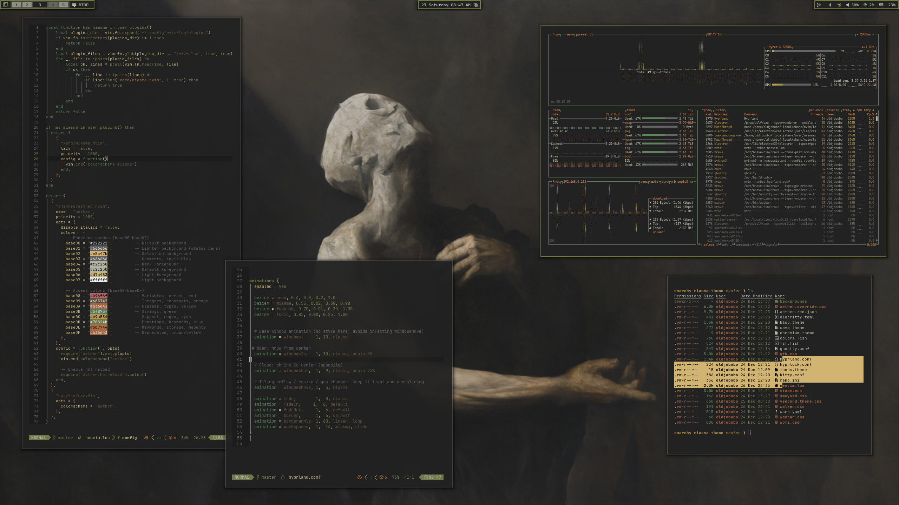

# Omarchy Miasma Theme

Dark, organic Miasma palette for Omarchy/Hyprland, with matching terminal, UI, and app themes plus a small wallpaper set.



## Install

Use the Omarchy theme installer:

```bash
omarchy-theme-install https://github.com/OldJobobo/omarchy-miasma-theme
```

## What's included

- Hyprland rules and opacity tuning (`hyprland.conf`)
- Hyprlock styling (`hyprlock.conf`)
- Waybar colors (`waybar.css`)
- Terminals: Alacritty (`alacritty.toml`), Kitty (`kitty.conf`), Ghostty (`ghostty.conf`), Warp (`warp.yaml`)
- Shell/tools: Fish colors (`colors.fish`), fzf (`fzf.fish`)
- Apps/UI: GTK (`gtk.css`), Chromium (`chromium.theme`), Wofi (`wofi.css`), Walker (`walker.css`)
- System tools: btop (`btop.theme`), cava (`cava_theme`), mako (`mako.ini`), SwayOSD (`swayosd.css`)
- Extras: Steam (`steam.css`), Vencord (`vencord.theme.css`), icons pointer (`icons.theme`)
- Aether theme overrides (`aether.override.css`, `aether.zed.json`)

## Neovim note

`neovim.lua` checks for the official Miasma theme (`https://github.com/xero/miasma.nvim`). If it is not installed, it falls back to an Aether-generated Miasma variant bundled with this theme.

## Wallpapers

<table>
  <tr>
    <td align="center" valign="top"><br><sub>a_close_up_of_a_person_with_wings.jpg</sub></td>
    <td align="center" valign="top"><br><sub>a_painting_of_a_man_with_a_dripping_face.jpg</sub></td>
    <td align="center" valign="top"><br><sub>a_painting_of_a_man_with_a_face_on_his_head.png</sub></td>
  </tr>
</table>

## Attribution

- Miasma palette by xero: <https://github.com/xero>
- Waybar modified from HANCORE-Linux's waybar themes: <https://github.com/HANCORE-linux/waybar-themes>
